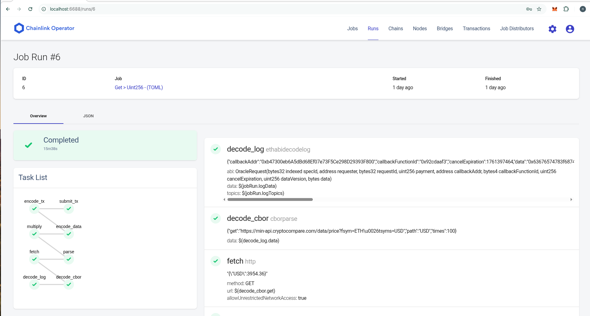
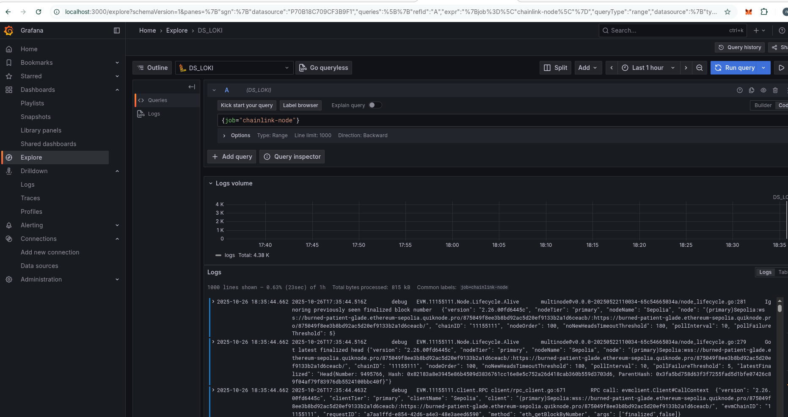
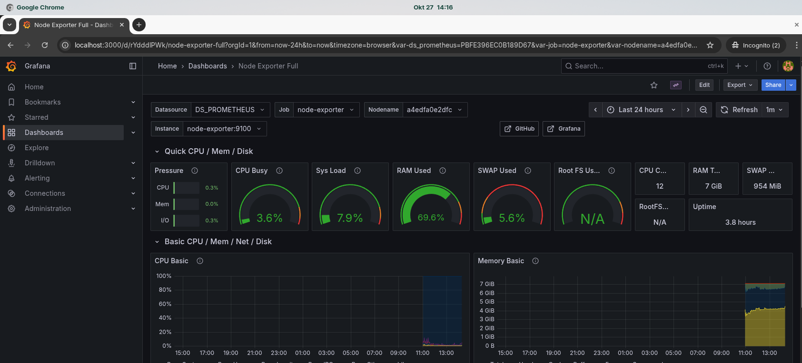

# 1. Chainlink Node Deployment: Setup, Monitoring, and Incident Response

## Table of Contents
- [Description](#description)
- [Assumptions](#assumptions)
- [Deploying the Chainlink Node](#deploying-the-chainlink-node)
- [Log collection and Analysis](#log-collection-and-analysis)
- [Monitoring Tools](#monitoring-tools)
- [Handling Incidents](#handling-incidents)

### Description
- Setting up ,preparing and  monitoring a Chainlink node involves several steps from the initial deployment to ensuring that the system is able process jobs efficiently. Below are the instructions on setting up the node, preparing the node, configuring monitoring tools and handling incidents.

### Assumptions:
- You are using a Linux environment (Ubuntu or similar) for the deployment.
- You have Docker and Docker Compose installed.
- You have access to an Ethereum node (e.g., via QuickNode,Infura or your own Ethereum client).
- PostgreSQL is available for the Chainlink node database.
- The goal is to run a Chainlink node 

---

### Deploying the Chainlink Node

#### Step 1: Clone Chainlink Repository

``` yaml
git clone https://github.com/kamal9002/chainlink-node-lab.git
cd chainlink-node-lab
```

#### Step 2: Enviroment Setup

Set up credentails & Environment Variables:
 - Replace  <YOUR_QUICKNODE_ID>  in config.toml and  <PASSWORD> with your actual values in following files:
    - docker-compose-yml
    - secret.toml

    <YOUR_QUICKNODE_ID> - update httpurl & wssurl for Ethereum Test provider  from (QuickNode, Alchemy,etc)
    Replace the placeholders with your desired email and password `.api` for UI credentails to login in operator

#### Step 3: Deploying the apps

##### Stack Overview

| Service                     | Description                                                          | Ports  |
| --------------------------- | -------------------------------------------------------------------- | ------ |
| **chainlink_v2-node**       | Chainlink Node service exposing API/UI and job execution             | `6688` |
| **chainlink_v2-postgres**   | PostgreSQL database storing jobs and node data                       | `5432` |
| **loki**                    | Centralized log aggregation service                                  | `3100` |
| **promtail**                | Log collector for Docker containers → sends logs to Loki             | —      |
| **node_exporter**           | Host-level metrics exporter (CPU, memory, disk, network)             | `9100` |
| **prometheus**              | Metrics collection system; scrapes Node Exporter & Chainlink metrics | `9090` |
| **grafana**                 | Visualization & alerting platform; connects to Prometheus & Loki     | `3000` |

Ensure you are in the `docker-compose.yml` directory after updating environment variables and credentials.And execute the commands:-
                 
```yaml
    docker compose up -d  # Bring up the Docker Compose stack 
    docker compose ps   # check all the containers are healthy and up
```

once  all the containers are healthy , access the operator UI and grafana in browser 
 - [Operator UI](http://localhost:6688/)


### Preparing Your Chainlink Node
 - Refer to the following to prepare chainlink node for performing smart contract operations
     - [Fulfilling Requests Guide](https://docs.chain.link/chainlink-nodes/v1/fulfilling-requests)

 - once afte completion of the above setup success job completion can be viewed from Node Operators UI :
    

### Log collection and Analysis
 - This stack is pre-configured with log aggregation and collector.Once Promtail pushes logs to Loki, you can query and visualize them in grafana:
    Example query:
        Explore tab to verify the correct label name for your Chainlink logs, e.g., job="chainlink-node" (labels according to promtail config)
    
    

### Monitoring Tools
 - This stack is pre-configured with infrastructure monitoring . It sets up **Prometheus** for data collection, the **Node Exporter** to gather system metrics from the host, and **Grafana** for visualization, with the datasource and dashboard automatically provisioned on startup.
    - [grafana ui](http://localhost:3000/) 
    - [Prometheus ui](http://localhost:9090/)
  
    - Node Exporter Dashboard for system metrics

      

### Handling Incidents
 - step-by-step instructions on managing and resolving incidents, refer to the [playbook-incident](docs/Incident-Response.md)